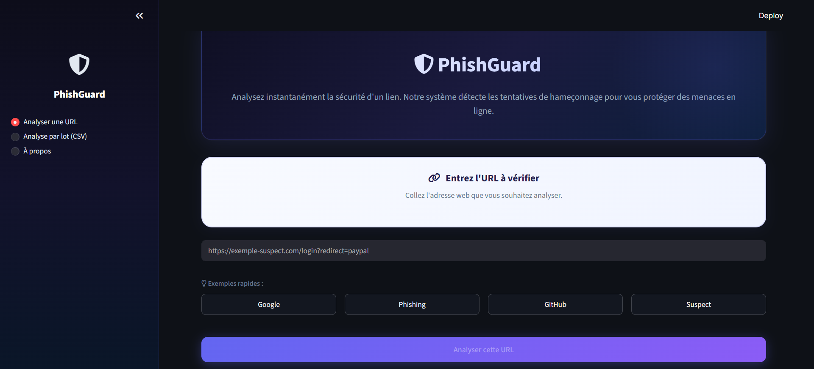
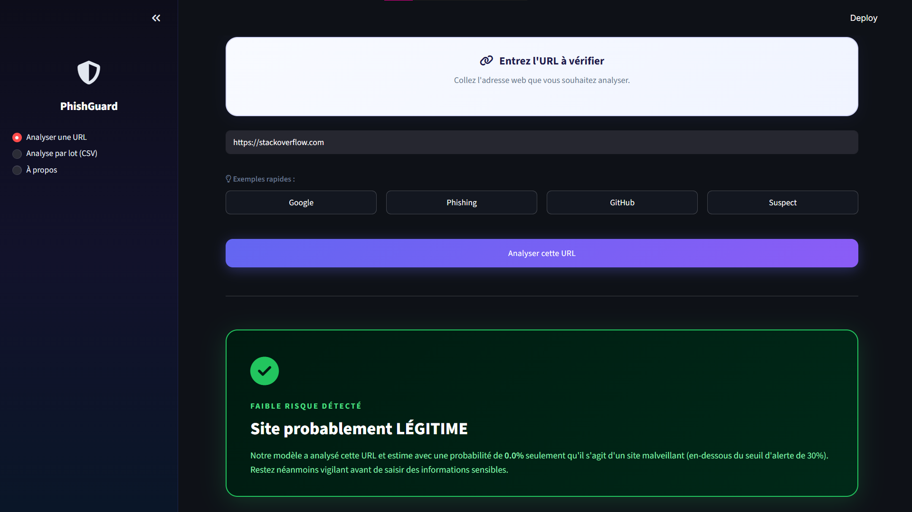
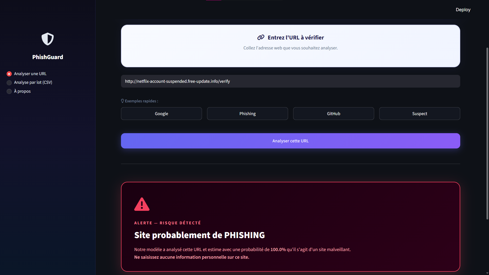
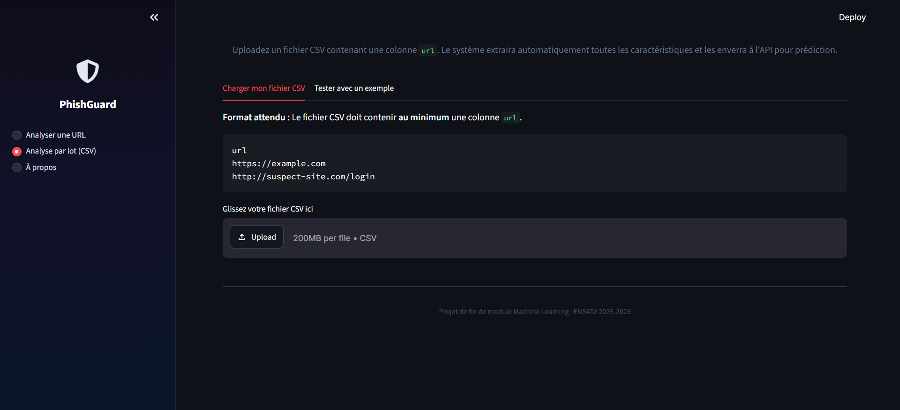
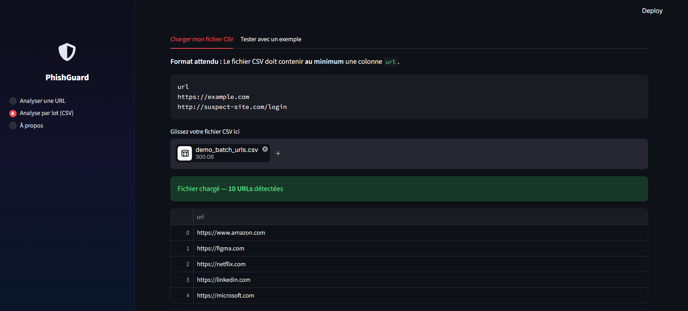
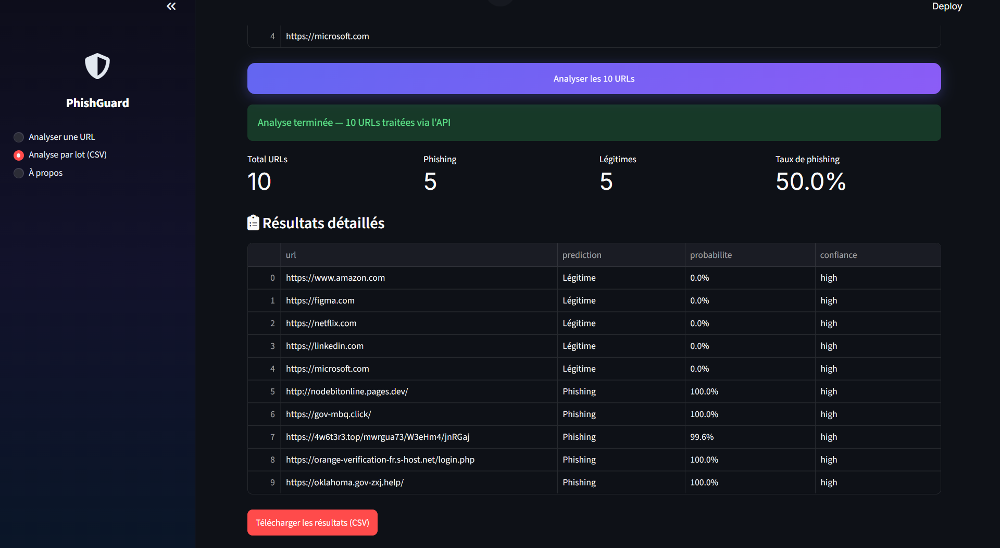
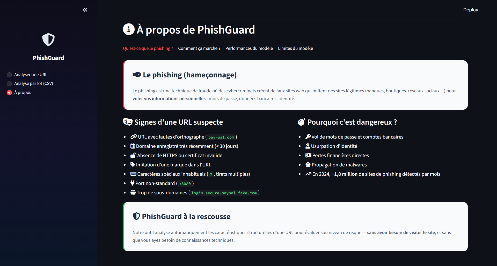
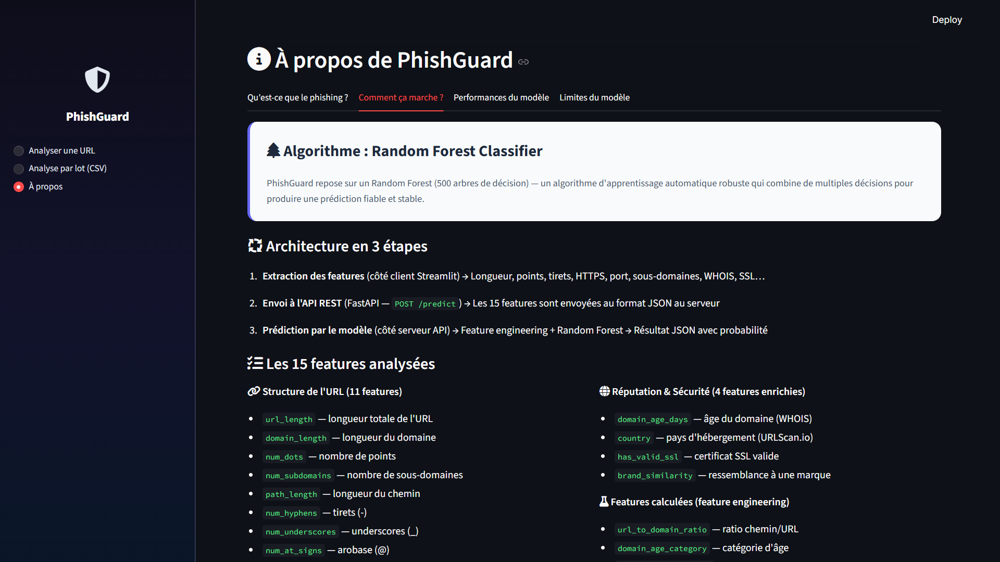
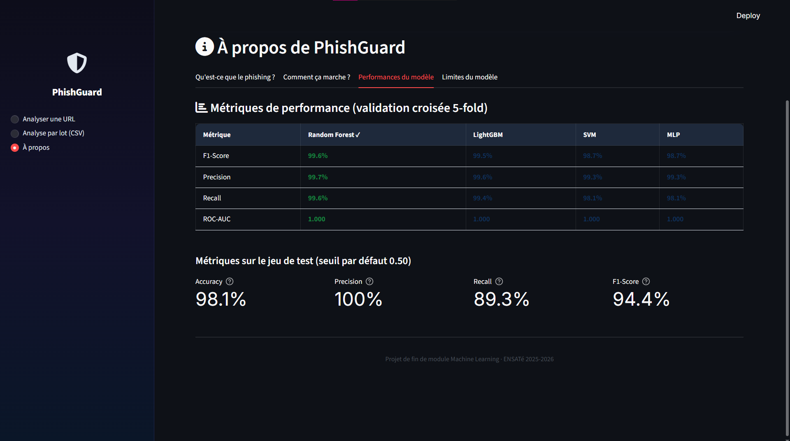
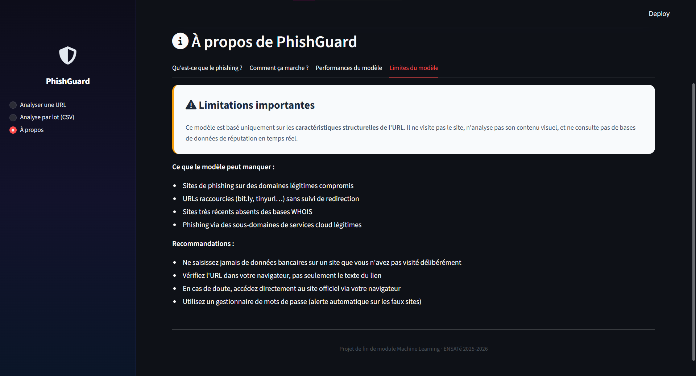

# PhishGuard : Détecteur de Phishing ML (Phish-Detect ML)

Ce projet est une solution complète de Machine Learning permettant de détecter automatiquement les sites web de phishing à partir de l'analyse de leur URL. L'application intègre un modèle de Random Forest pré-entraîné, exposé via une API REST performante (FastAPI) et rendu accessible aux utilisateurs finaux grâce à une interface web interactive (Streamlit). L'ensemble du système permet des prédictions unitaires ou par lots avec un haut niveau de confiance, garantissant portabilité et reproductibilité via Docker.

---

## Captures d'écran de l'interface (Flux Utilisateur)

Voici le flux complet de l'application.

### 1. Page "Analyser une URL" (Prédiction unitaire)


### 2. Résultat de l'analyse : Site Légitime


### 3. Résultat de l'analyse : Site de Phishing


### 4. Page "Analyse par lot (CSV)" : Interface de chargement


### 5. Résultat de l'Analyse par lot



### 6. Page "À propos"





---

## Installation et Démarrage

### Option 1 : Démarrage rapide avec Docker (Recommandé)
Assurez-vous d'avoir [Docker Desktop](https://www.docker.com/) installé et démarré sur votre machine.

```bash
# 1. Cloner le dépôt
git clone https://github.com/essebaiyayaa/phish-detect-ml.git
cd phish-detect-ml

# 2. Copier le fichier d'environnement (optionnel — pour les clés API)
cp .env.example .env

# 3. Lancer l'application complète (API + UI en arrière-plan)
docker compose up -d
```

Une fois démarré :
- Interface Streamlit : **http://localhost:8501**
- API FastAPI : **http://localhost:8000**
- Documentation Swagger : **http://localhost:8000/docs**

### Option 2 : Installation manuelle (Sans Docker)
Nécessite Python 3.11+.

```bash
# 1. Cloner le dépôt
git clone https://github.com/essebaiyayaa/phish-detect-ml.git
cd phish-detect-ml

# 2. Créer et activer un environnement virtuel
python -m venv venv
# Windows :
venv\Scripts\activate
# Linux/macOS :
source venv/bin/activate

# 3. Installer les dépendances figées
pip install -r requirements.txt

# 4. Lancer l'API FastAPI (Terminal 1)
python -m uvicorn app.main:app --host 0.0.0.0 --port 8000

# 5. Lancer l'interface Streamlit (Terminal 2)
streamlit run app/streamlit_ui.py
```

---

## Endpoints de l'API

| Méthode | Endpoint | Description |
|---|---|---|
| `GET` | `/` | Page d'accueil avec informations sur l'API et lien vers la documentation Swagger |
| `GET` | `/health` | Vérifie que l'API et le modèle sont opérationnels — retourne `200 OK` |
| `GET` | `/model/info` | Métadonnées du modèle : type, version, features, métriques de performance, seuil utilisé |
| `POST` | `/predict` | Prédiction unitaire : reçoit les 15 features d'une URL, retourne classe + probabilité |
| `POST` | `/predict/batch` | Prédiction par lot : reçoit un fichier CSV de features, retourne un CSV enrichi des prédictions |

### Schéma de réponse de `/predict`

```json
{
  "prediction": "phishing",
  "probability": 0.92,
  "threshold": 0.3,
  "confidence": "high"
}
```

| Champ | Type | Description |
|---|---|---|
| `prediction` | `string` | Verdict final : `"phishing"` ou `"legitime"` |
| `probability` | `float` | Probabilité brute d'appartenir à la classe phishing (entre 0 et 1) |
| `threshold` | `float` | Seuil de décision appliqué (0.3 — optimisé pour maximiser le Recall) |
| `confidence` | `string` | Niveau de confiance : `"high"` (>90%), `"medium"` (70-90%), `"low"` (<70%) |

---

## Exemple d'utilisation

> **ℹ️ Note importante selon votre système d'exploitation**
> - **Windows PowerShell** : utilisez `Invoke-WebRequest` — la commande `curl` est un alias qui ne fonctionne pas avec JSON
> - **macOS / Linux / Git Bash** : utilisez `curl` directement

---

### 1. Vérifier que l'API est démarrée (`/health`)

#### 🪟 Windows PowerShell
```powershell
Invoke-WebRequest -Uri "http://localhost:8000/health" | Select-Object -ExpandProperty Content
```

#### macOS / Linux
```bash
curl http://localhost:8000/health
```

**Réponse attendue :**
```json
{
  "status": "healthy",
  "timestamp": "2026-06-10T10:00:00.000000",
  "model_loaded": true
}
```

---

### 2. Prédiction unitaire (`/predict`)

#### 🪟 Windows PowerShell
```powershell
Invoke-WebRequest -Method POST -Uri "http://localhost:8000/predict" `
  -ContentType "application/json" `
  -Body '{"url_length": 52, "domain_length": 28, "num_dots": 3, "num_subdomains": 2, "num_hyphens": 1, "num_underscores": 0, "num_at_signs": 0, "path_length": 15, "brand_similarity": 0.8, "domain_age_days": 5, "has_port": 0, "has_https": 0, "has_http_in_domain": 1, "has_valid_ssl": 0, "country": "UNKNOWN"}' `
  | Select-Object -ExpandProperty Content
```

#### macOS / Linux
```bash
curl -X POST "http://localhost:8000/predict" \
  -H "Content-Type: application/json" \
  -d '{
    "url_length": 52,
    "domain_length": 28,
    "num_dots": 3,
    "num_subdomains": 2,
    "num_hyphens": 1,
    "num_underscores": 0,
    "num_at_signs": 0,
    "path_length": 15,
    "brand_similarity": 0.8,
    "domain_age_days": 5,
    "has_port": 0,
    "has_https": 0,
    "has_http_in_domain": 1,
    "has_valid_ssl": 0,
    "country": "UNKNOWN"
  }'
```

**Réponse JSON attendue :**
```json
{
  "prediction": "phishing",
  "probability": 0.998,
  "threshold": 0.3,
  "confidence": "high"
}
```

---

### 3. Prédiction par lot (`/predict/batch`)

Fournissez un fichier CSV contenant les colonnes de features — utilisez `data/sample.csv` comme modèle de format.

#### 🪟 Windows PowerShell
```powershell
curl.exe -X POST "http://localhost:8000/predict/batch" -F "file=@data/sample.csv"
```

#### macOS / Linux
```bash
curl -X POST "http://localhost:8000/predict/batch" \
  -F "file=@data/sample.csv"
```

Le retour est un fichier CSV enrichi avec les colonnes `prediction`, `probability` et `threshold`.

---

### 4. Informations sur le modèle (`/model/info`)

#### 🪟 Windows PowerShell
```powershell
Invoke-WebRequest -Uri "http://localhost:8000/model/info" | Select-Object -ExpandProperty Content
```

#### macOS / Linux
```bash
curl http://localhost:8000/model/info
```

---

### 5. Flow Utilisateur — Interface Web Streamlit
1. **Accès :** Ouvrir `http://localhost:8501` dans un navigateur.
2. **Saisie :** Coller une URL suspecte (ex: `http://paypal-secure-login.verify-account.com/login`) dans la barre de recherche.
3. **Analyse :** Le système extrait automatiquement les 15 caractéristiques de l'URL (structure syntaxique, certificat SSL, âge du domaine via WHOIS, similarité de marque).
4. **Résultat :** L'interface affiche le verdict (**Phishing** ou **Légitime**), la jauge de probabilité animée, le niveau de confiance, et des explications textuelles des facteurs de risque détectés.

---


## Architecture du dépôt

```text
phish-detect-ml/
├── app/                        # Code source de l'application
│   ├── main.py                 # API REST (FastAPI) — 5 endpoints, validation Pydantic, logging
│   └── streamlit_ui.py         # Interface Utilisateur interactive (Streamlit, 3 pages)
├── data/                       # Données (brutes, traitées, exemples)
│   ├── dataset.parquet         # Dataset complet (11 000 lignes × 17 colonnes)
│   ├── dataset_engineered.parquet  # Dataset après feature engineering (Phase 2)
│   └── sample.csv              # Extrait de 100 lignes — format d'entrée pour /predict/batch
├── figures/                    # Graphiques EDA et captures d'écran de l'UI
├── models/                     # Modèles sérialisés (artefacts ML)
│   ├── final_model.joblib      # Modèle Random Forest final (~4.4 MB)
│   └── preprocessor.joblib     # Pipeline de prétraitement (RobustScaler + OHE)
├── notebooks/                  # Notebooks Jupyter numérotés par phase
│   ├── 01_discovery.ipynb      # Phase 1 — Exploration initiale et EDA
│   ├── 02_eda.ipynb            # Phase 1 — Analyse exploratoire approfondie
│   ├── 03_preprocessing.ipynb  # Phase 2 — Nettoyage, FE, pipeline
│   ├── 04_modeling.ipynb       # Phase 3 — Entraînement SVM, MLP, RF, LightGBM
│   ├── 05_tuning.ipynb         # Phase 3 — Hyperparameter tuning
│   └── 06_evaluation.ipynb     # Phase 3 — Évaluation finale et sélection du modèle
├── results/                    # Résultats numériques de la Phase 3
│   ├── phase3_results_summary.csv      # Métriques CV-5 par modèle
│   ├── rebalancing_comparison.csv      # Comparaison des stratégies de rééquilibrage
│   ├── phase3_metrics_comparison.png   # Graphique comparatif des modèles
│   └── phase3_f1_evolution.png         # Évolution du F1 par fold
├── src/                        # Scripts métier et utilitaires
│   └── data_collection.py      # Collecte PhishTank + Tranco, extracteur de features URL
├── Dockerfile.api              # Image Docker pour l'API FastAPI (python:3.11-slim)
├── Dockerfile.streamlit        # Image Docker pour l'UI Streamlit (python:3.11-slim)
├── docker-compose.yml          # Orchestrateur — réseau interne, healthchecks, volumes
├── requirements.txt            # Dépendances figées (reproductibilité garantie)
├── .dockerignore               # Fichiers exclus des images Docker (data/, notebooks/, .git)
├── .env.example                # Template des variables d'environnement (clés API)
└── README.md                   # Ce fichier de documentation principale
```

---

## Documentation de l'API (Swagger)

FastAPI génère automatiquement une documentation interactive basée sur OpenAPI.
Une fois l'API démarrée, testez les requêtes directement depuis votre navigateur :

**[http://localhost:8000/docs](http://localhost:8000/docs)**

---

## Limites connues du modèle

Bien que le modèle présente d'excellentes performances (F1 = 0.9962, Recall = 0.9960), quelques limites inhérentes à l'approche doivent être notées :

1. **URLs raccourcies (Shorteners) :** Les services comme `bit.ly` ou `tinyurl.com` masquent les caractéristiques structurelles réelles de la destination finale. Le modèle analyse l'URL raccourcie — qui ressemble à une URL légitime courte — et non la page de destination réelle.
2. **Domaines légitimes compromis (Piraterie) :** Un site web historiquement fiable piraté pour héberger une page malveillante conservera des attributs « sûrs » (âge de domaine ancien, SSL valide). Le modèle ne peut pas détecter ce cas sans analyse du contenu de la page.
3. **Faux Positifs sur les jeunes entreprises :** De nouvelles entreprises légitimes avec des domaines récemment créés (< 30 jours) peuvent déclencher l'alerte par excès de prudence.
4. **Dépendance réseau externe :** L'extraction des features enrichies (WHOIS, SSL) dépend de la disponibilité de services externes et requiert une connexion internet stable.

---

## Licence

Ce projet est distribué sous la licence **MIT**. Vous êtes libre de l'utiliser, le modifier et le distribuer à des fins éducatives ou commerciales, sous réserve d'inclure la notification de copyright originale.
